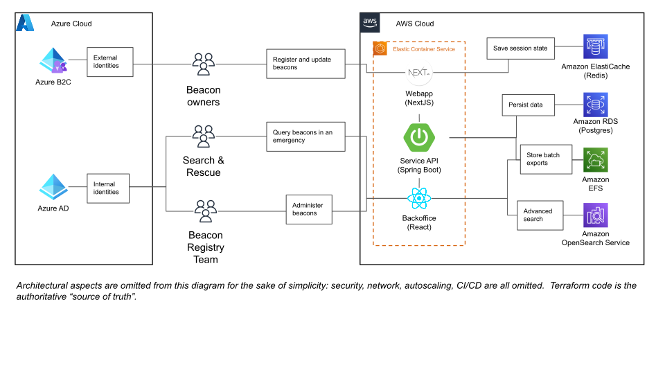

[](https://github.com/prettier/prettier)


# Beacons registration service

The Beacons registration service enables:

- [406Mhz beacon](https://www.gov.uk/maritime-safety-weather-and-navigation/register-406-mhz-beacons) owners to register their details with the Maritime & Coastguard Agency
- Search and rescue [Mission Control Centres](<https://en.wikipedia.org/wiki/Mission_control_centre_(Cospas-Sarsat)>) to retrieve information about beacons during distress signal activations

It comprises three applications:

1. A public-facing frontend that uses [NextJS](https://nextjs.org/) and the [GOV.UK Design System]
   (https://design-system.service.gov.uk/).
   - Source code is in the `webapp/` directory.
   - Application specific documentation is in the [README](./webapp/README.md).
2. An API that uses [Spring Boot](https://spring.io/projects/spring-boot), [Postgres](https://www.postgresql.org/)
   and [OpenSearch](https://opensearch.org/).
   - Source code is in the `service/` directory.
   - Application specific documentation is in the [README](./service/README.md).
3. A backoffice single-page application (SPA) that uses [React](https://reactjs.org/docs/create-a-new-react-app.html)
   to allow users in MCA to query and perform operations on beacon registrations.
   - Source code is in `service/src/main/backoffice`.
   - The SPA is served by Spring Boot.
   - Application specific documentation is in the [README](./backoffice/README.md).

## Testing

Application specific tests are covered in the READMEs linked to above.

If you are working towards a release, look at the [end-to-end and smoke test documentation](./tests/README.md).

Known issues and resolution for Unit, Integration and End-to-end testing are documented in the [tests README.md file](./tests/README.md).

## Architecture



Infrastructure-as-code remains the single source-of-truth for Beacons infrastructure! Always check `terraform/` if
unsure.

## Local development

Before you start...

- Make sure you have the required versions of things installed
  - Install [brew](https://brew.sh/) onto your laptop if you are using a Mac.
  - Install [mise-en-place](<[asdf-vm.com](https://mise.jdx.dev/)>)
  - Install [docker](https://docs.docker.com/engine/install/), or `brew install --cask docker-desktop`.
  - See the `.tool-versions` if you want to manage them some other way.
- Copy `webapp/.env.example` as `webapp/.env.local` and populate it with the contents of the "Beacons Webapp Local .env.local config" secure note in 1Password. Please ensure you click "Edit" in 1Password before copying the config.
- Get the Microsoft Graph secrets into your environment variables from "Microsoft Graph Secrets - TEST" from 1Password to your terminal.
  - Please use [direnv](https://direnv.net/) to manage this.
  - Save the `.envrc.example` file in the root of the repository as `.envrc` and populate the values with what's in "Microsoft Graph Secrets - TEST" in 1Password
- Install all the things, setup commit hooks etc.
  - ```bash
    # From the root of this repository
    make setup
    ```
- Start up the applications in development mode, with backing services
  - ```bash
    # From the root of this repository≠
    make serve
    ```

### Local development without Azure

If you don't have the Azure and 1Password secrets above, or want to work offline, you can run everything with a single
local user instead:

1. Set `BEACONS_LOCAL_AUTH=true` in your `.envrc` (see `.envrc.example`) and run `direnv allow`.
2. Optionally, to change the defaults:
   - copy `webapp/.env.local-auth.example` as `webapp/.env.local-auth` for the webapp's settings, which need nothing
     from 1Password. Without it, the example file is used.
   - copy `.envrc.local-auth.example` as `.envrc.local-auth` for the local user's email, password or Backoffice roles.
3. `make serve`, then sign in to the webapp with `dev@beacons.local` / `password`. The Backoffice signs you in as the
   same user automatically.

Each mode uses its own env files, so you can switch by changing the flag and restarting `make serve`:

|                           | `BEACONS_LOCAL_AUTH` unset or `false` (default) | `BEACONS_LOCAL_AUTH=true`                                                                |
| ------------------------- | ----------------------------------------------- | ---------------------------------------------------------------------------------------- |
| Root env                  | `.envrc` (Microsoft Graph secrets)              | `.envrc` plus the optional `.envrc.local-auth`                                           |
| Webapp env                | `webapp/.env.local`                             | `webapp/.env.local-auth`, or its `.example` if absent. Nothing is read from `.env.local` |
| Webapp sign-in            | Azure AD B2C                                    | `/account/sign-in`, using `LOCAL_AUTH_EMAIL` and `LOCAL_AUTH_PASSWORD`                   |
| Backoffice sign-in        | Azure AD                                        | Signed in automatically as the same user                                                 |
| Service authorisation     | Azure AD access tokens                          | Spring `localauth` profile: every request is the local user, with `LOCAL_AUTH_ROLES`     |
| Account holder identities | Microsoft Graph                                 | Stubbed out; writes are logged and discarded                                             |

This is for local development only. Deployed environments run the `default,migration` Spring profiles (see
`terraform/*.tfvars`) and never set `BEACONS_LOCAL_AUTH`. The service refuses to start if `localauth` is combined with
`default` or `migration`, or runs without `dev`.

## Infrastructure-as-code

The [Terraform](./terraform) directory contains the Terraform code for managing the infrastructure for the Beacons
registration service.

## Deployment

Automated testing, building and deployment is performed using GitHub Actions with configuration held in
`.github/workflows`.

### Development environment

A build and deployment to the development environment is triggered on each push to `main`. Docker images are tagged
with the hash of the triggering commit and published to AWS Elastic Container Registry. Images built and deployed to
for the development environment are ephemeral and not used anywhere else.

### Staging environment

Creating a pre-release triggers a versioned deployment to the staging environment of code at the HEAD of the main
branch. Docker images are tagged with the version tag of the release. Version tags must match the pattern `v*.*`.

### Production environment

Changing the status of a pre-release to `release` triggers a deployment to production of the images that were created
for the staging
environment. [Environment protection](https://docs.github.com/en/actions/managing-workflow-runs/reviewing-deployments)
is applied to the `production` environment such that another member of the development team is prompted to approve
deployments to production.

**Manual scenario testing that must be performed before and after each release is documented in [tests/](./tests).**

## Architectural Decision Records (ADRs)

We use [ADRs](./docs/adr) to document design choices that address functional and non-functional requirements that are
architecturally significant to the Beacons Registration project. Please see
this [record](docs/adr/0003-2021-02-24-when-to-adr.md) for how and when to document ADRs for the project.

## Secrets

Secrets are set in the Repository and injected during deployment.

## License

Unless stated otherwise, the codebase is released under [the MIT License][mit]. This covers both the codebase and any
sample code in the documentation.

The documentation is [&copy; Crown copyright][copyright] and available under the terms of the [Open Government 3.0][ogl]
licence.

[mit]: LICENCE
[copyright]: http://www.nationalarchives.gov.uk/information-management/re-using-public-sector-information/uk-government-licensing-framework/crown-copyright/
[ogl]: http://www.nationalarchives.gov.uk/doc/open-government-licence/version/3/
