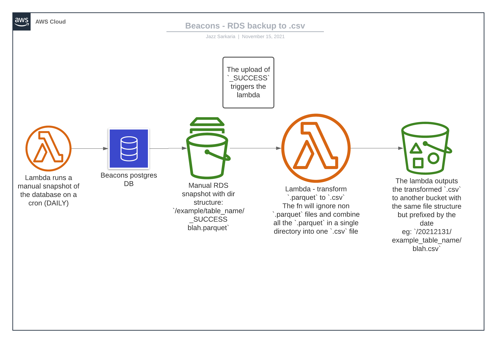

# Db Backup Lambda

This infrastructure deploys 2 lambdas. The first is run as a cron daily at 0100 am, it's job is to take a \
snapshot of the database tables and output them as [.parquet](https://parquet.apache.org/documentation/latest/) files to our s3 bucket. This process usually \
takes ~30 mins.

The second lambda is triggered by the parquet files being uploaded to the s3 bucket, it transforms the \
parquet files into csv files and uploads them to another bucket.

The purpose of these lambdas is to pull uploaded .parquet files from a S3 bucket directory. The `.parquet` \
file contains the output of a manual database snapshot and represent a database table broken into ~2mb \
chunks. The lambda is triggered when a `_SUCCESS` file is uploaded to the bucket. The lambda will pull all \
the `.parquet` files from that directory and combine the files into one array and then convert it to .csv. \
Once converted, the lambda pushes the file to a destination S3 bucket. To be picked up by Search and Rescue \
as a back up database.

We use Zod to ensure our runtime inputs are what we expect them to be see `src/types.ts` and `src/validation.ts`. \
The types are structured around the database schema, the schema can be found [here](./assets/schemacrawler.html)

## Infrastructure



## Development

When developing a new feature it's helpful to test your changes by spinning up your own stack. Make sure you \
have an aws profile exported and you also have filled out the relevant terraform vars in`terraform.tfvars`: \

```terraform.tfvars
name      = "dev"
region    = "eu-west-2"
kmsKeyId  = "xxxxxxxxx-yyyy-zzzz-aaaa-bbbbbbb"
accountId = "xxxxx"
```

It's useful to upload files from `tests/fixtures` to triger the transform lambda and then observe the lambda \
logs. When deploying with terraform I would create a terraform state bucket via the console and then copy \
the name into the backend s3 block in the root `main.tf`.

These commands are useful:

- `npm run build:all` - remember to run this if you have been making changes to the src code
- `terraform init`
- `terraform plan`
- `terraform apply`

## Unit Testing

Only the core functionality is tested, functions are designed to be modular and pure so that they can be \
easily tested by using closures and using functions as arguments they can be easily mocked and third party \
libraries can be ignored.

### Useful testing commands:

- `npx ts-node` - to start a REPL and test the lambda locally
- `npm run test` - run the unit tests

## e2e Testing

e2e testing uses the terratest frame work to spins up the terraform, then runs the commands to trigger the \
lambda and check the output. Make sure to export your AWS environment variables to run these commands from \
`tests/e2e`:

### Useful testing commands:

- `npm run build:all` - run if you have made changes to src
- `go mod tidy` - to install the required go modules
- `go test -v -timeout 30m` - to run the tests

## Todos:

- [ ] add config for different environments via ci
- [ ] Only allowed 100 manual snapshots as a limit
- [ ] Alert if the back up fails (perhaps to slack)
- [ ] add terraform dynamo db table to lock the terraform state if it is currently deploying
